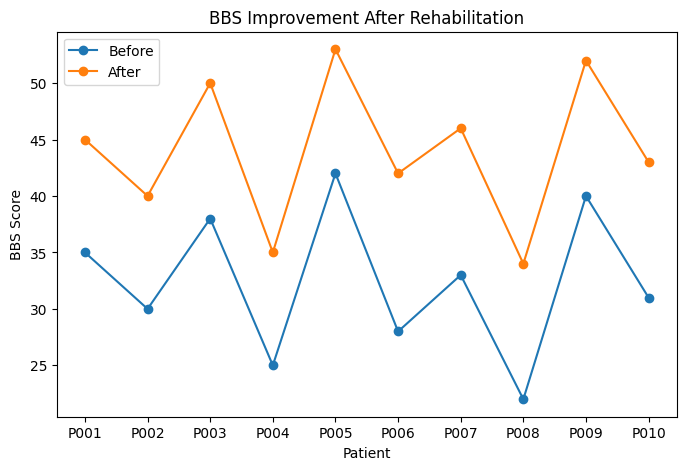

# Clinical Patient Dataset Analyzer

A Python-based clinical data analysis project for evaluating rehabilitation outcomes using patient assessment data.

## Overview

This project demonstrates a clinical analytics pipeline for rehabilitation datasets. It loads patient assessment data, performs statistical analysis, evaluates functional outcomes, and generates visual reports to support rehabilitation progress assessment.

The project focuses on analyzing clinical measurements commonly used in rehabilitation monitoring, including **Berg Balance Scale (BBS)** and **Timed Up and Go (TUG)** assessments.

## Features

- Load clinical patient datasets using Pandas
- Perform basic clinical statistical analysis
- Calculate demographic and clinical metrics
- Analyze rehabilitation outcome improvements
- Evaluate functional changes using:
  - Berg Balance Scale (BBS)
  - Timed Up and Go (TUG)
- Generate visualization outputs for clinical interpretation

## Dataset

The sample dataset contains patient-level rehabilitation assessment data, including:

- Patient ID
- Age
- Gender
- Height and Weight
- BMI
- BBS score before and after rehabilitation
- TUG test results before and after rehabilitation

## Technologies

- Python
- Pandas
- NumPy
- Matplotlib

## Project Structure

```text
clinical-patient-dataset-analyzer/

├── data/
│   └── patients.csv                  # Sample clinical rehabilitation dataset

├── src/
│   ├── data_loader.py                # Load patient data from CSV files
│   ├── analysis.py                   # Clinical statistical analysis functions
│   └── visualization.py              # Generate clinical outcome visualizations

├── results/
│   └── figures/
│       └── bbs_improvement.png       # BBS improvement visualization result

├── main.py                           # Main project execution script

├── requirements.txt                  # Required Python packages

└── README.md                         # Project documentation
```

## Example Output

The project generates statistical summaries and visual reports showing rehabilitation outcome changes between pre-intervention and post-intervention assessments.

Example metrics:

- Number of patients analyzed
- Average patient age
- Average BMI
- Average BBS improvement
- Average TUG improvement

Example output:

```text
Clinical Patient Analysis
-------------------------

number_of_patients: 10
average_age: 58.90
average_BMI: 27.23
average_BBS_improvement: 11.60
average_TUG_improvement: 5.83
```

## Visualization

The project generates visual reports to evaluate rehabilitation improvement.

### BBS Improvement Before and After Rehabilitation



## Code Preview

Example of the clinical analysis pipeline:

```python
from src.data_loader import load_patient_data
from src.analysis import basic_statistics

data = load_patient_data("data/patients.csv")

statistics = basic_statistics(data)

print(statistics)
```

## Future Improvements

- Add automated missing data detection
- Include additional clinical assessment metrics
- Develop interactive dashboards for healthcare data visualization
- Integrate machine learning models for rehabilitation outcome prediction

## Author

Biomedical Engineering Student  
Healthcare Data Analytics & Medical AI Projects